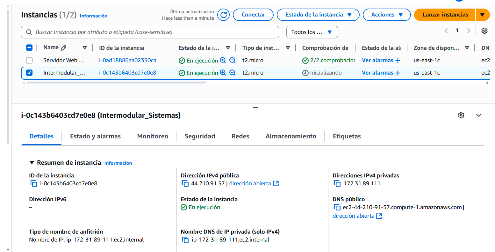
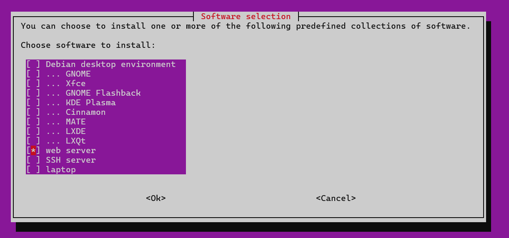
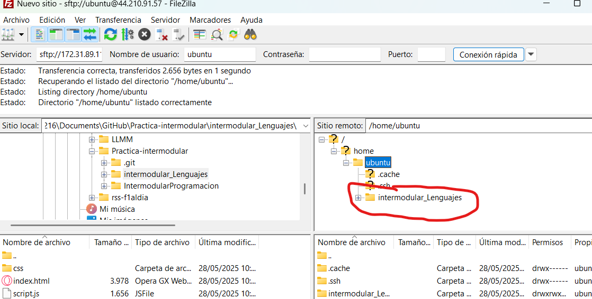
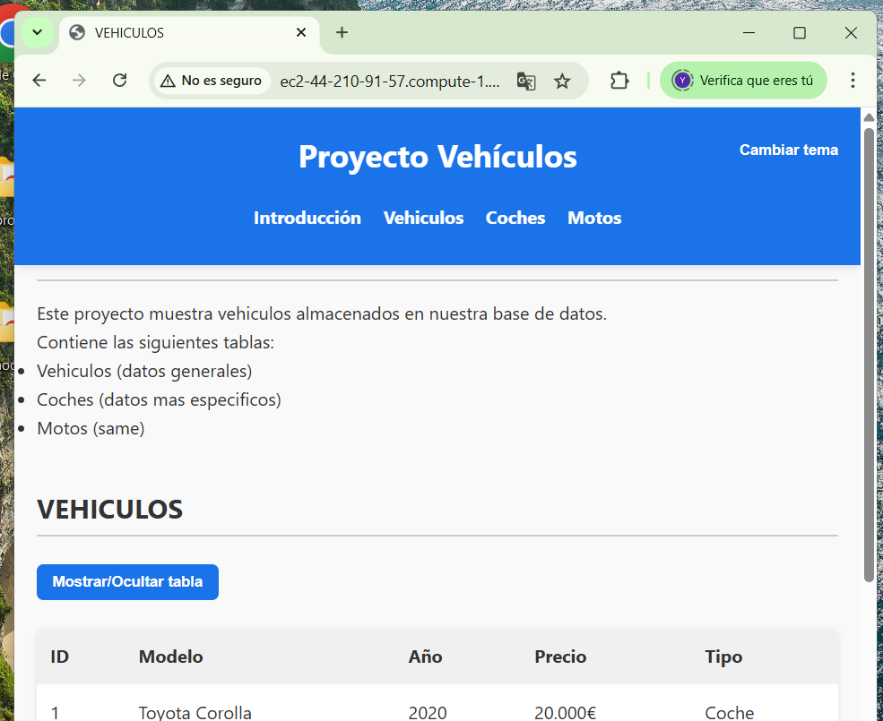

# Despliegue del Sitio Web en AWS

---

## 1. Creación de la Instancia EC2 en AWS

Se creó una nueva instancia EC2 con las siguientes características:

- Sistema operativo: Ubuntu Server 22.04 LTS
- Tipo de instancia: t2.micro (dentro del nivel gratuito)
- Grupo de seguridad: Puertos abiertos HTTP (80) y SSH (22)

## 2. Instalación del servidor web

- Con "sudo apt install tasksel" una vez instalado lanzamos la herramienta.
- Seleccionas el apartado web server y lo instalamos.

## 3. Transferir los archivos de la pagina web

Vamos a usar FileZilla para transferir los archivos de la pagina a la maquina virtual:

- Abrimos FileZilla y nos conectamos a la maquina virtual
- Pasamos los archivos a la carpeta /home/Ubuntu
- Y ya una vez dentro de la maquina virtual pasamos los archivos a la carpeta /home/ubuntu/tu_carpeta /var/www/HTML

## 4. Página cargando correctamente desde el navegador

Ya para terminar abriremos la pagina web desde el navegador:

